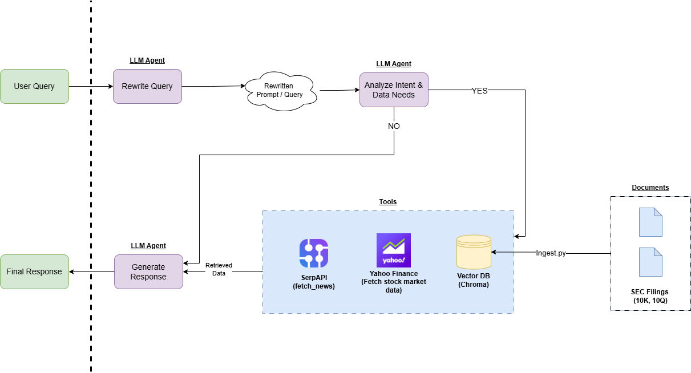

# FinInsightBot Demo

Lightweight, stateful financial analysis agent using LLMs + RAG (retrieval-augmented generation).  
It rewrites conversational queries, analyzes intent, conditionally fetches market data, news, or documents, and returns streaming answers via a FastAPI SSE endpoint.



## Key features
- Stateful conversational agent (Pydantic state model)
- Query rewriting & intent analysis (LLM-based)
- Conditional data fetching: fundamentals & technicals (yfinance), news (SerpAPI), local document retrieval (Chroma)
- Document ingestion & summarization pipeline
- Streaming Server-Sent Events (SSE) API for partial responses
- Simple test coverage and ingestion script

## Quick start (Windows PowerShell)
1. Create a venv and install deps:
```powershell
python -m venv .venv
.venv\Scripts\Activate.ps1
pip install -r requirements.txt
```

2. Set required environment variables (PowerShell):
```powershell
$env:GOOGLE_API_KEY="your_google_api_key"
$env:SERP_API_KEY_1="your_serp_api_key"
# optionally set other keys used by your environment
```

3. (Optional) Ingest documents into Chroma DB:
```powershell
python app/scripts/ingest.py
```

4. Run the API:
```powershell
uvicorn app.main:app --reload --port 8000
```

## Tests
Run unit/integration tests:
```powershell
python -m pytest app/tests -q
```

## Project layout (important files)
- app/main.py — FastAPI server and SSE endpoint
- app/agents/financial_agent_graph.py — workflow / agent graph
- app/agents/financial_agent_state.py — state model
- app/agents/nodes/analysis.py — query resolution & intent analysis
- app/agents/nodes/data_fetching.py — market/news/docs retrieval
- app/agents/nodes/response.py — final answer generation
- app/utils/llm.py — LLM clients & helpers
- app/clients/* — yfinance, SerpAPI, Chroma client code
- app/scripts/ingest.py — document ingestion pipeline

## Environment variables (minimum)
- GOOGLE_API_KEY — required for configured LLM client
- SERP_API_KEY_1 — SerpAPI key for news
- Any other API keys referenced in config.py

## Notes & recommendations
- This repo is intended for experimentation for financial agentic RAG LLM
- Watch quotas for external APIs (SerpAPI, Google).
- The ingestion script populates a local Chroma DB used for RAG.

## License
